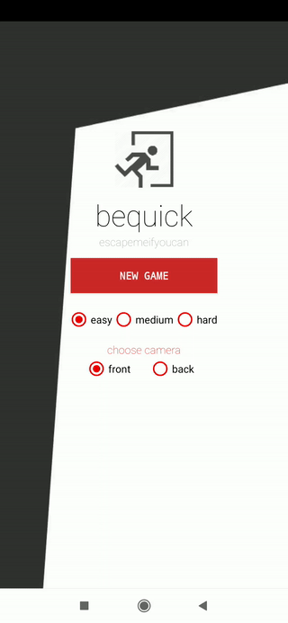

# bequick

:rabbit: bequick is mobile application game based on image processing to having fun some with your family or colleagues.

You can reach from : 

## Overview

bequick is a game which can play with your friends or family, enjoy and test your minimal reflex skills. 

* Stable your phone with a stand or sth.
* Put an object to field of view of camera
* Open bequick game
* Try to remove object without being alarmed.

bequick is using below technologies and written with computer vision techniques. This app will be using as a scratch for implementing computer vision and mobile application.

Using tech :

* OpenCV
* Android NDK
* Java

## Details

The frames are taken, processed with pre-process computer vision techniques and passed to taken absolute difference of frames.

https://docs.opencv.org/2.4/modules/core/doc/operations_on_arrays.html

The first frame is taken into an array and got absolute difference with next frame.

## Screens

  

  

